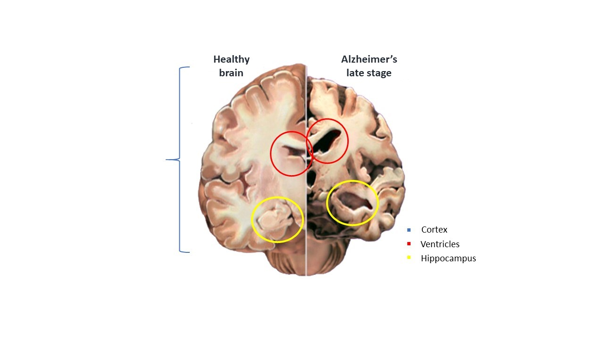
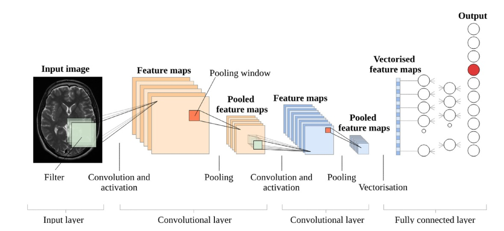
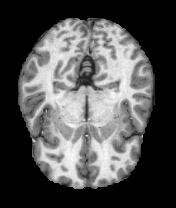
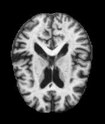
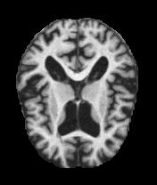

# Diagnosis of Alzheimer's Disease: A Transfer Learning Method

## Table of Contents

1. [Overview](#overview)
2. [Key Features/Technologies](#key-featurestechnologies)
3. [Datasets] (#datasets)
4. [Contributors](#contributors)

## Overview

This project focuses on the task of image classification to diagnose Alzheimer's and dementia from medical MRIs. It involves a binary and a multiclass classification, with corresponding labels:

Binary:
- Healthy
- Dementia
  
Multiclass:
- healthy
- very mild dementia
- mild dementia
- moderate dementia

## Key Features/Technologies 

- Binary and multiclass classification of Alzheimer's and dementia.
- Five pretrained CNNs: AlexNet, ResNet101, ResNet50, GoogLeNet, InceptionResNetV2.
- Fine-tuning models on different datasets for cross validation.
- MATLAB
- Transfer Learning

  

## Datasets
- OASIS (https://www.oasis-brains.org/)
- Alzheimer-MRI-dataset (https://www.kaggle.com/datasets/legendahmed/alzheimermridataset/metadata)
- ADNI (https://adni.loni.usc.edu/)

  
  
  

  
## Contributors

- Andrea Loddo (https://github.com/andrealoddo)
- Cecilia Di Ruberto
